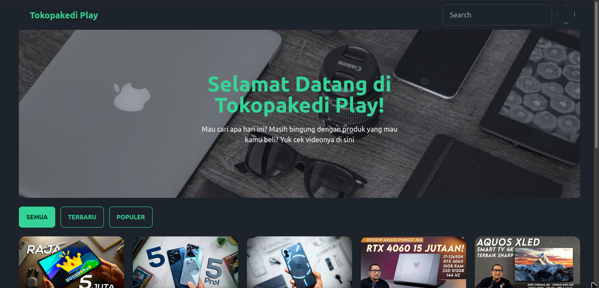

# Tokopakedi Play REST API

Tokopakedi Play is a clone from [Tokopedia Play](https://www.tokopedia.com/play/channels). This repository countains the source code and examples for building a React.js website.



## Installation

1. Clone the repository by running the below code on your terminal

```bash
git clone https://github.com/mfajririki/tokopakedi-play-react.git
```

3. Open the project directory or

```bash
cd tokopakedi-play-react
```

4. copy .env file

```bash
cp .env.example .env
```

5. edit variables on .env file to your local environment

6. Use the package manager `npm` to install ora `yarn` if you use it

```bash
npm install

or

yarn
```

7. Run the project

```bash
npm start

or

yarn dev
```

8. Access the App at `http://localhost:5371/`

Happy coding! :)
